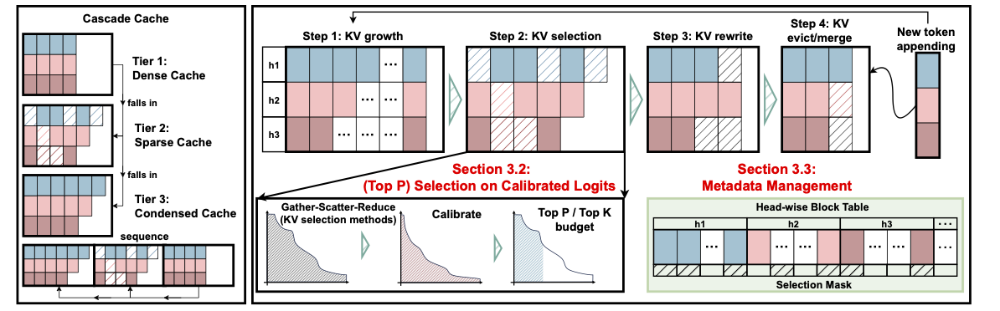

<div align="center">
  
</div>

# HARD-KV: Head-Adaptive Regularization for Decoding-time KV Compression

This is the code repo for implementing paper **HARD-KV: Head-Adaptive Regularization for Decoding-time KV Compression**, featured by 

- Cascade Cache: a combined structure of 3 tiers of cache (Condense, Sparse and Dense), supporting **Cautious Update** for different KV selection methods.

- Head-wise Block Layouts: supporting block-wise allocation and sparsification of KV cache. More flexible and more accurate. 

- Full Inference Engien Integration: supporting engine-level features continuous batching and CUDA Graph, bringing KV cache in to system-level design. 

For further details, please refer to [docs/architecture.md](docs/architecture.md)


## Quick Start 

We recommand to set up environments with uv. 

First run 
```
uv sync
```

Then follow [patch.md](patch.md) for applying a critical fix for flashinfer regarding `packed_custom_mask` and `mask_indptr` interfaces. 

Finally run with 
```
uv run python -m eval.test
```

Note: Remember to provide you envrionments in .env like
```
MODEL_PATH=(path to your model weights in hf format)
DATA_PATH=(path to you datasets)
```

and run `export UV_ENV_FILE=.env`

## Full Experiments

We provide simple scripts in ./scripts. The results are main produced by `./eval/baseline` (nanovllm_base) for naive top-k allocation and by `./eval/condense` (nanovllm_HARD) for our implementations. 

Feel free to try with different models and methods, or even contribute custome version of KV selections methods or model supports. 

### Fixed Budget Performance

**Comparison across budget sizes {1024, 2048, 4096}.** *Top-p budget for our methods is 0.90.*

| Method | Config | 1024 Acc | 1024 Len | 2048 Acc | 2048 Len | 4096 Acc | 4096 Len |
| :--- | :--- | :---: | :---: | :---: | :---: | :---: | :---: |
| | | | | | | | |
| **Dataset: AIME24** | | | | | | | |
| *Full Attention (Ref)* | *--* | - | - | - | - | **79.9%** | **13735.7** |
| SnapKV | Base | 6.2% | 31323.1 | 21.3% | 23860.3 | 57.7% | 19157.4 |
| | **+ Ours** | **13.3%** | **32768.0** | **40.2%** | **28471.4** | **56.7%** | **21616.5** |
| RKV | Base | 13.3% | 30423.2 | 23.3% | 27968.0 | 43.3% | 23281.5 |
| | **+ Ours** | **23.4%** | **30480.8** | **53.3%** | **27819.6** | **57.9%** | **28094.0** |
| | | | | | | | |
| **Dataset: AIME25** | | | | | | | |
| *Full Attention (Ref)* | *--* | - | - | - | - | **63.3%** | **17528.8** |
| SnapKV | Base | 3.1% | 31007.5 | 19.3% | 26291.5 | 27.9% | 25621.4 |
| | **+ Ours** | **3.3%** | **31796.3** | **23.3%** | **30152.4** | **42.3%** | **25228.6** |
| RKV | Base | 10.8% | 31879.5 | 21.9% | 27706.7 | 40.0% | 23944.3 |
| | **+ Ours** | **17.8%** | **32279.0** | **26.7%** | **31068.6** | **56.7%** | **28231.6** |
| | | | | | | | |
| **Dataset: UMath** | | | | | | | |
| *Full Attention (Ref)* | *--* | - | - | - | - | **50.4%** | **9815.7** |
| SnapKV | Base | 18.0% | 22350.7 | 41.8% | 19021.4 | 46.7% | 12420.2 |
| | **+ Ours** | **15.5%** | **27705.7** | **46.2%** | **22499.4** | **49.4%** | **14520.4** |
| RKV | Base | 28.1% | 19625.3 | 35.1% | 17915.2 | 39.9% | 27429.7 |
| | **+ Ours** | **24.1%** | **24346.1** | **52.0%** | **24748.5** | **50.3%** | **21296.5** |

## Visualiation Guides

see [docs/viz/visualize_guides.md](docs/viz/visualize_guides.md)