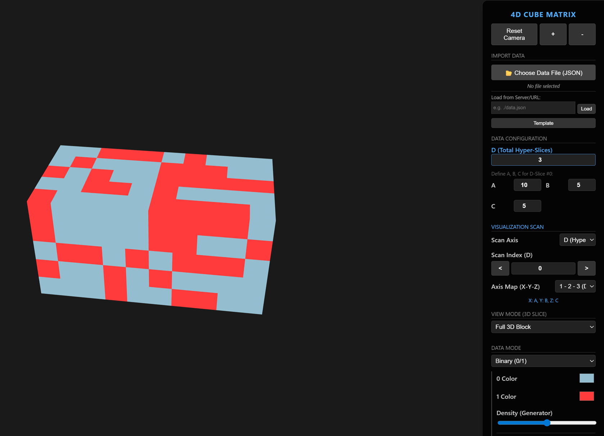
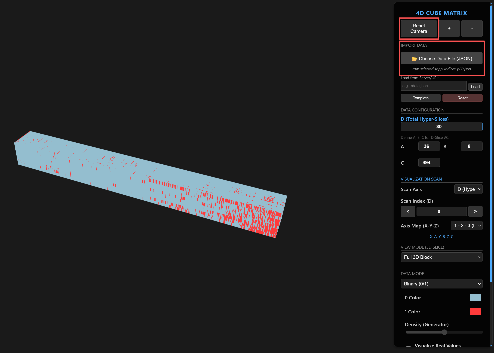
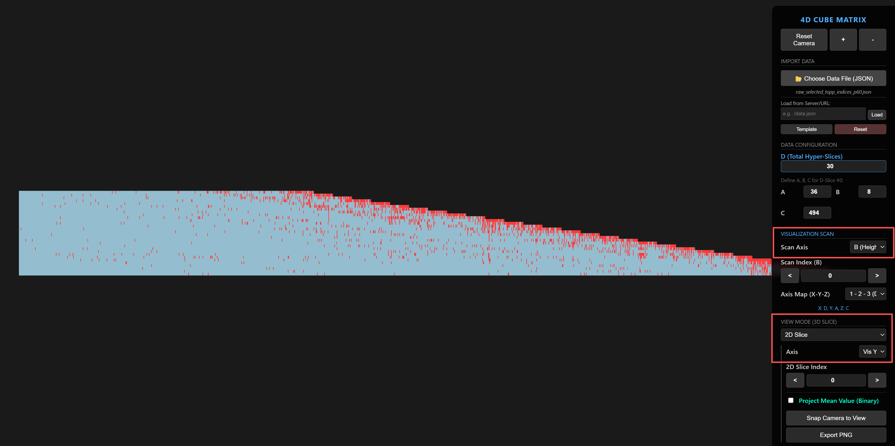
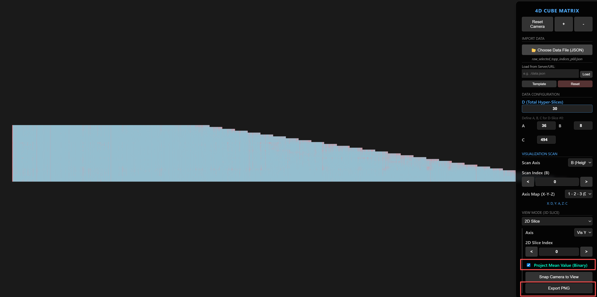
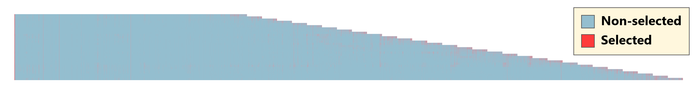

# Guides on Visualizing Attention Patterns

## Step 1: Run html 
```
cd ./viz_tools/viz_attn
python -m http.server
```

The visualization interface will be shown as:


## Step 2: Prepare data
The raw data are collected with `config.if_log_compress=True` in nanovllm_HARD.

Conver the .npz format data to .json data. 
```
python ./viz_tools/npz_to_json.py
```

## Step 3: Load the data


Load the json data from the local files (you can use the json data in ./demo_logs). Then Reset Camera for suitable view


## Step 4: Choose the desired slice

The shape of the data is in essence 4D tensor `[Step (D), Layer(A), Head(B), Sequence(C)]`, so you need set hyper slice (D) for 3D visualization. Similarly, you need to set the "scan slice" for 2D visualiation. 



## Step 5: Save figure

Finally you can save the figure with labels and 


This example is saved in 
