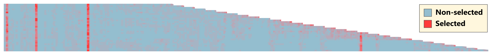
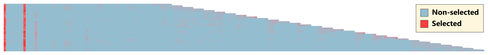
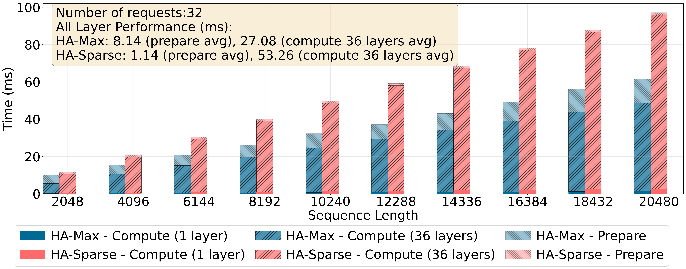
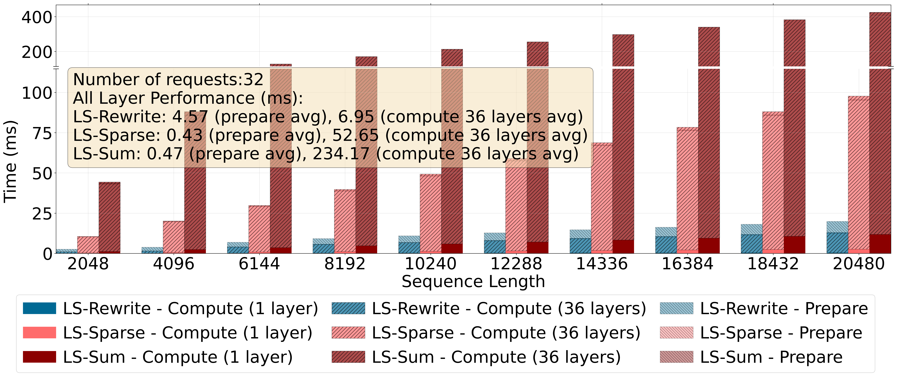
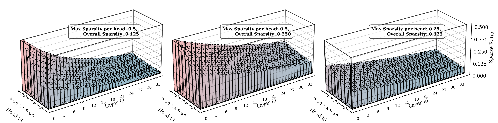
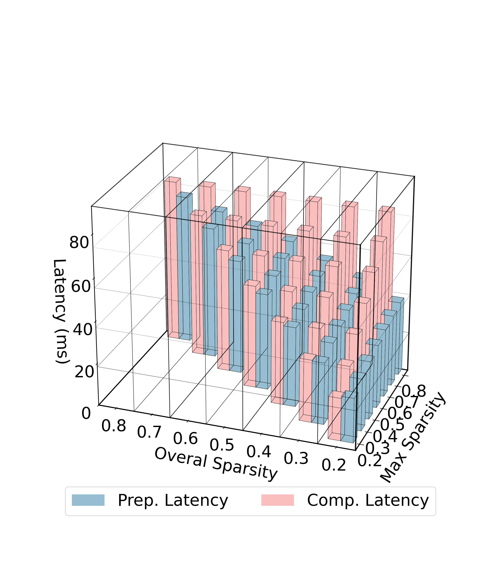

# Guides on Visualizing Attention Patterns
 

For guides on produce the figures above, see
[visualize_attn.md](./visualize_attn.md)

# Guides on Visualizing Latency Breakdowns for Different Tasks
 

For guides on produce the figures above, see
[visualize_task.md](./visualize_task.md)

# Guides on Visualizing 3d figures

For guides on produce the figures above, see
[visualize_3d.md](./visualize_3d.md)